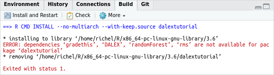

# dalextutorial

Branch   |[](https://travis-ci.org)
---------|------------------------------------------------------------------------------------------------------------------------------------------------
`master` |[](https://travis-ci.org/richelbilderbeek/dalextutorial)
`develop`|[](https://travis-ci.org/richelbilderbeek/dalextutorial)

## Install and run

Clone the repository:

```
git clone https://github.com/friesewoudloper/dalextutorial

usethis::install_github("rstudio-education", "gradethis")
```

In Rstudio, do 'Open Project' on `dalextutorial.Rproj`.

In the top-right panel, click the 'Build' tab, then 'Install and restart':



If there is a package missing, install it from RStudio 
using 'Tools | Install package'.

To install the `gradethis` package, use:

```r
remotes::install_github("rstudio-education/gradethis")
```

