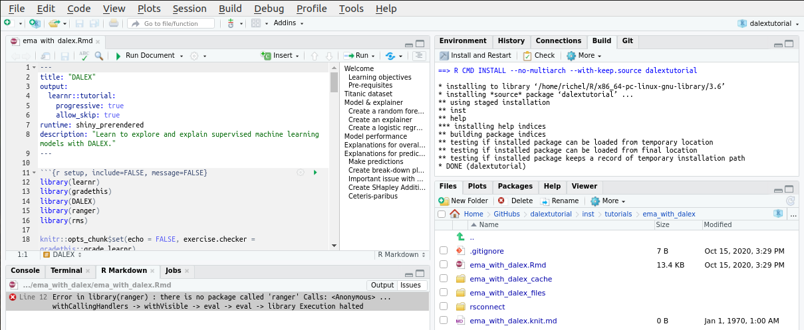
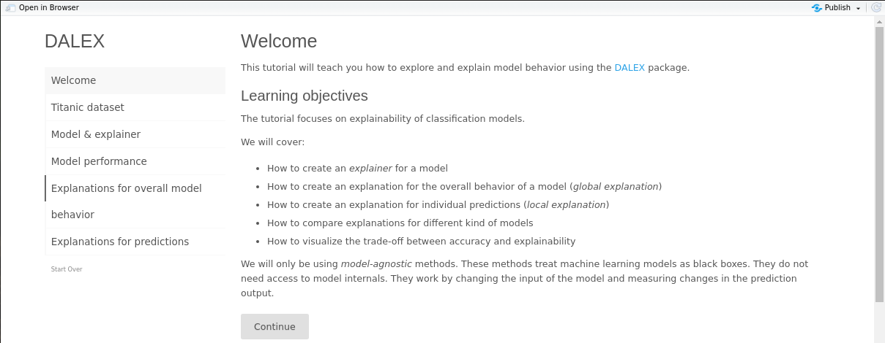

# dalextutorial

Branch   |[](https://travis-ci.org)
---------|------------------------------------------------------------------------------------------------------------------------------------------------
`master` |[](https://travis-ci.org/richelbilderbeek/dalextutorial)
`develop`|[](https://travis-ci.org/richelbilderbeek/dalextutorial)

## Install and run

Clone the repository:

```
git clone https://github.com/friesewoudloper/dalextutorial

usethis::install_github("rstudio-education", "gradethis")
```

In Rstudio, do 'Open Project' on `dalextutorial.Rproj`.

In the top-right panel, click the 'Build' tab, then 'Install and restart':


If there is a package missing, install it from RStudio 
using 'Tools | Install package'.

To install the `gradethis` package, use:

```r
remotes::install_github("rstudio-education/gradethis")
```

Then, in the bottom-right panel, click on the 'Files', then go to the
'inst | tutorials | ema_with_dalex' and click on `ema_with_dalex.Rmd`.
Click om 'Run document'.

If you get the error below, install the needed package and click 'Run document' again.



Now, you are ready to go:




install_after_run_document.png

